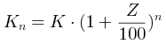
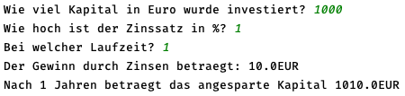

Erstellen Sie ein Programm, welches zur Zinsberechnung eingesetzt werden kann.
  Das Programm soll die folgenden Informationen von der Konsole (Tastatur) einlesen:

* Das investierte Kapital in € (Gleitkommazahl)
* Der vereinbarte Zins pro Jahr in Prozent (ganze Zahl)
* Die vereinbarte Laufzeit in Jahren (ganze Zahl).

Die Formel zur Berechnung des Guthabens lautet:

Hierbei ist Kn das nach n Jahren angesparte Kapital inklusive Zinsen, K das investierte Kapital und Z der Zinssatz in Prozent.

Das Programm soll die folgenden Werte berechnen und ausgeben:
  * Den durch Zinsen erwirtschafteten Betrag nach der Laufzeit n
  * Das nach der Laufzeit n angesparte Kapital

Ablauf mit Bildschirmausgabe (grün = Eingaben des Anwenders; Ihre Lösung muss eine analoge Ausgabe erzeugen):

  

* Zur Berechnung einer Exponentialfunktion xn gibt es in Java **keinen** Operator.
Stattdessen muss eine Funktion verwendet werden.
Schlagen Sie die Klasse `Math` in der Dokumentation nach, diese bietet eine passende Methode an.
Verwenden Sie diese Methode in Ihrer Implementierung!
* Runden ist nicht notwendig!

